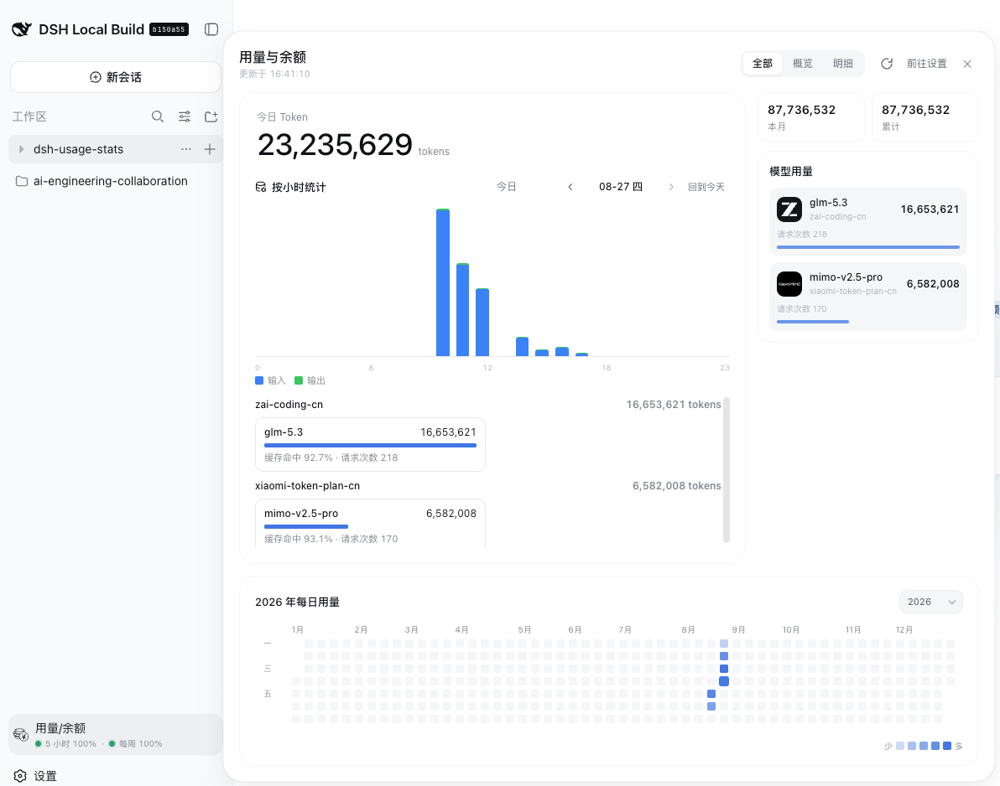
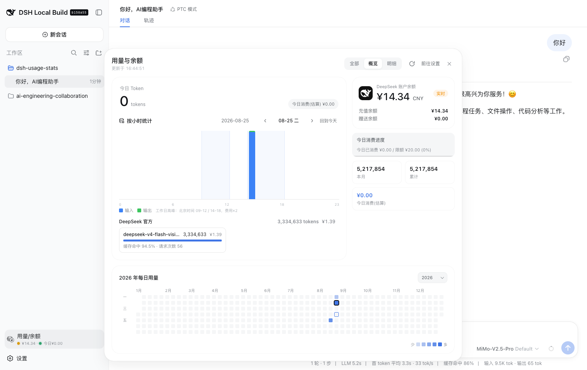
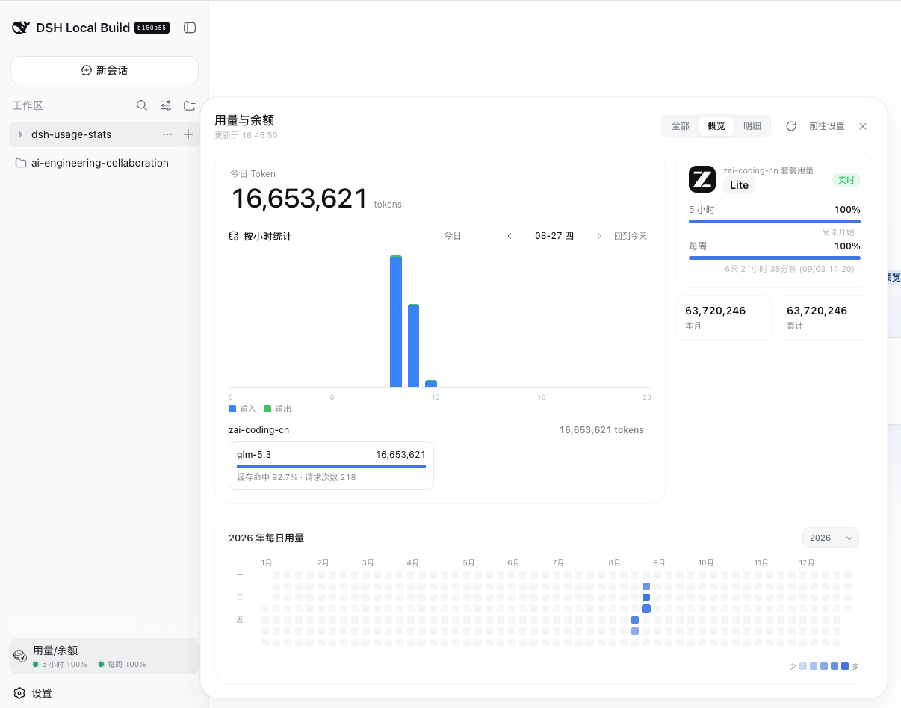
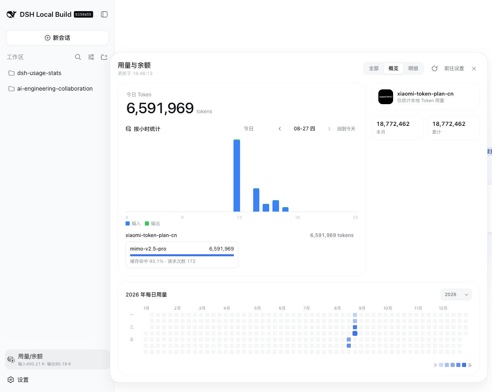
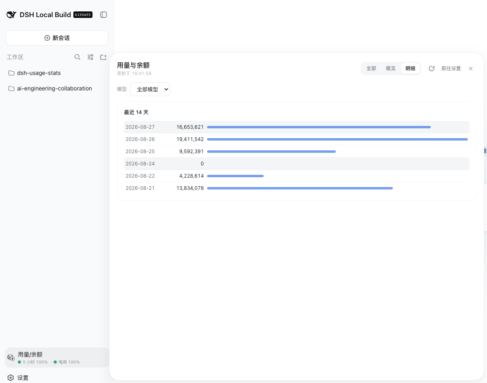
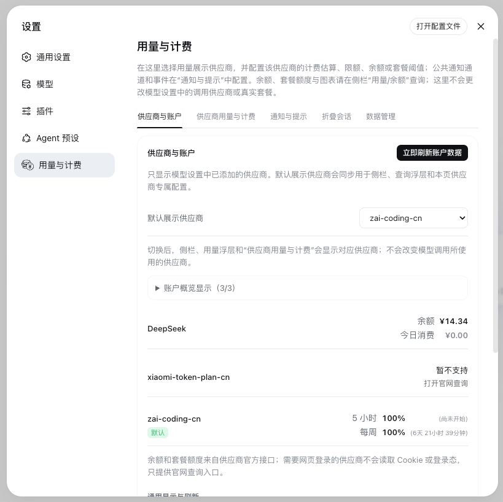
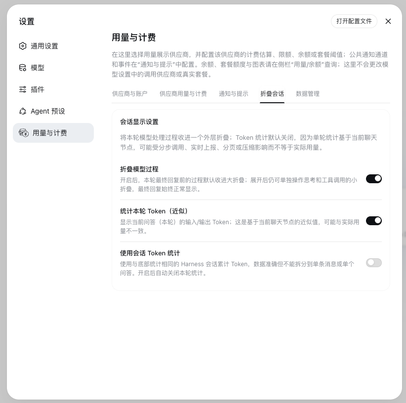

# dsh-usage-stats

面向 [DeepSeek Harness](https://github.com/deepseek-ai/deepseek-harness) Web GUI（`dsh web`）的本地用量中心：统一查看 Token、余额、套餐额度、DeepSeek 费用估算和每日趋势，并可将一轮会话中的思考与工具过程折叠起来，让对话正文保持清爽。

The local usage, balance, quota, billing, and conversation-folding companion for DeepSeek Harness Web.

**文档导航：** [核心亮点](#核心亮点--features) · [Provider 支持](#provider-支持) · [界面预览](#界面预览--screenshots) · [快速安装](#快速安装--quick-start) · [配置](#配置--configuration) · [数据与隐私](#数据与隐私--privacy)

## 核心亮点 / Features

| 能力 | 你可以做什么 |
| --- | --- |
| 用量查询中心 | 从侧栏直接打开只读查询面板，在「全部 / 概览 / 明细」间切换，不把配置表单混入数据浏览流程 |
| 多供应商账户 | 展示 DeepSeek/Moonshot 余额、Z.ai/Kimi/MiniMax/OpenCode Go 套餐窗口、OpenRouter Key 额度与账户 Credits；小米及 MiMo Token Plan 提供官方查询入口；账户概览最多固定 3 个供应商 |
| 时间与模型分析 | 查看今日 / 本月 / 累计 Token、请求次数、24 小时输入输出、模型拆分、缓存命中率与自然年贡献热图 |
| 费用与限额 | 冻结 DeepSeek 官方调用费用，配置每日消费限额、余额提醒、预警比例、通知和可选超限停止 |
| **折叠会话思考过程** | **把同一问答中的思考、工具调用和过程说明收进一个外层折叠，最终回复始终保持可见** |
| 本机数据边界 | API Key 只在服务端凭据服务中解析；统计账本、设置和告警保存在本机，插件 RPC 仅接受回环请求 |

### 折叠会话思考过程

开启「设置 → 用量与计费 → 折叠会话 → 折叠模型过程」后，每个问答（turn）只生成一个外层过程折叠：

- 思考、工具调用和过程说明默认收起，展开后仍可单独操作原有的小折叠；
- 最终回复始终位于外层折叠之外，不会因为过程很长而被一起隐藏；
- 整体耗时与可选 Token 汇总只显示在外层折叠上，避免每个步骤重复展示；
- 「本轮 Token（近似）」与「会话 Token」互斥且默认关闭：前者按当前问答节点估算，后者与 Harness 底部会话累计统计保持同口径。

> 查询面板保持只读。默认展示供应商、计费、限额、通知、会话折叠和数据管理统一位于「设置 → 用量与计费」。切换默认展示供应商不会改变模型调用路由。

### 数据口径

- Token 来自 provider-reported `usage`（`assistant/chunk`、`assistant/message` 或 `llm/stream` usage chunk），统计 API 不使用本地 tokenizer 估算。
- 请求次数按 `provider/model` 的独立用量样本统计；同一 `(turn, step)` 的流式中间样本与最终样本只计一次。冻结归档沿用每个模型桶的 `entryCount`。
- 调用级 ledger 按 `provider/model` 归集；日期、小时、费用和「今日」限额均按请求完成时间对应的北京时间计算。
- 只有 `deepseek-official` 参与 CNY 费用估算和消费限额；其他供应商保留 Token、余额或套餐额度展示。
- 界面支持中文和英文；供应商列表来自 Harness 当前已经添加的可配置 provider route，不会猜测或探测未知远端接口。

## Provider 支持

| route 示例 | 远端查询 | 能否直接复用模型设置中的 Key | 展示与额外操作 |
| --- | --- | --- | --- |
| `deepseek-official`、`deepseek` | `/user/balance` | 可以 | 余额、CNY 费用估算、每日消费限额与余额提醒 |
| `moonshotai`、`moonshotai-cn` | `/v1/users/me/balance` | 可以 | USD/CNY 可用余额、现金与代金券余额；Key 必须与国际/国内站匹配 |
| `openrouter` | `/api/v1/key`，可选 `/api/v1/credits` | Key 查询可复用 | 普通模型 Key 的消费上限、已用与剩余额度；账户 Credits 需额外配置 `OPENROUTER_MANAGEMENT_KEY`，不会拿普通模型 Key 试探该接口 |
| `opencode-go` | `/zen/go/v1/usage` | 可以 | OpenCode Go 5 小时滚动 / 每周 / 每月订阅窗口；已有接口查询，不重复显示官网按钮 |
| `opencode` | 无 API-key 余额接口 | 不适用 | 不读取网页登录态；显示 [OpenCode Zen workspace 查询入口](https://opencode.ai/workspace/wrk_01KN1AVY46S9P0AQNE6GNGNQE0) |
| `kimi-coding` | `/coding/v1/usages` | 可以 | 5 小时 / 每周 Token 窗口；月总额度不读取网页登录态，提供 [Kimi 我的额度](https://www.kimi.com/membership/subscription?tab=quota) 入口 |
| `minimax`、`minimax-cn` | Token Plan 查询（兼容多个官方路径） | 可以 | 5 小时 / 每周比例窗口 |
| `zai`、`zai-coding-cn` | `/api/monitor/usage/quota/limit` | 可以 | 5 小时 / 每周剩余比例与重置时间 |
| `xiaomi` | 无稳定的 API-key 用量接口 | 不适用 | 不读取网页登录态；显示 [MiMo API Key 用量入口](https://platform.xiaomimimo.com/console/usage) |
| `xiaomi-token-plan-cn`、`xiaomi-token-plan-ams`、`xiaomi-token-plan-sgp` | 暂无稳定的 API-key 配额接口 | 不适用 | 不读取 Cookie/CDP；显示 [MiMo Token Plan 官网查询入口](https://platform.xiaomimimo.com/console/plan-manage) |

`declared` 只表示 Harness 目录来源，不代表官方认证。插件仅过滤 `vision-toolkit-*` facade，其余已添加 route 按 Harness 原名展示；没有内置远端适配器的 provider 仍可统计本地 Token。

## 设置结构

「设置 → 用量与计费」按职责拆分为五个标签：

| 标签 | 内容 |
| --- | --- |
| 供应商与账户 | 选择默认供应商和最多 3 个账户概览项，查看账户快照，配置额外只写查询凭据、刷新周期与侧栏摘要；不会修改模型调用路由 |
| 供应商用量与计费 | DeepSeek 限额、余额提醒、峰谷价格与可选硬停止；套餐 provider 的窗口状态阈值 |
| 通知与提示 | 侧栏状态点、页面 Toast、预警/超限/余额不足/恢复事件、冷却时间和进程内告警历史 |
| **折叠会话** | **过程大折叠、本轮 Token 近似统计、会话累计 Token 统计** |
| 数据管理 | 近期精细记录、冻结金额精确归档与历史估算范围；按北京日历裁剪、恢复估算或二次确认清空本地数据 |

每日消费进度只表达「今日消费 / 每日限额」，不会被余额提醒状态改变。套餐阈值仅控制状态提示颜色，不会修改供应商真实额度。

## 界面预览 / Screenshots

「全部」聚合所有供应商；「概览」聚焦默认展示供应商；「明细」按最近日期对比用量。套餐供应商显示窗口额度和重置时间，余额型供应商显示余额；年度热图、小时趋势和模型拆分适用于各类已记录用量。点击任意缩略图可查看原始截图。

<table>
  <tr>
    <td align="center"><a href="assets/screenshots/usage-overview-all.png"></a><br /><sub>全部供应商概览</sub></td>
    <td align="center"><a href="assets/screenshots/usage-overview-deepseek.png"></a><br /><sub>DeepSeek 余额与用量</sub></td>
    <td align="center"><a href="assets/screenshots/usage-overview-zai.png"></a><br /><sub>Z.ai 套餐额度</sub></td>
  </tr>
  <tr>
    <td align="center"><a href="assets/screenshots/usage-overview-xiaomi-token-plan.png"></a><br /><sub>MiMo Token Plan</sub></td>
    <td align="center"><a href="assets/screenshots/usage-details.png"></a><br /><sub>按日明细</sub></td>
    <td align="center"><a href="assets/screenshots/settings-providers.png"></a><br /><sub>供应商与账户设置</sub></td>
  </tr>
  <tr>
    <td align="center"><a href="assets/screenshots/settings-conversation-folding.png"></a><br /><sub>折叠会话设置</sub></td>
    <td align="center"><a href="assets/screenshots/conversation-folding-demo.png"></a><br /><sub>会话过程折叠演示</sub></td>
    <td></td>
  </tr>
</table>

## 快速安装 / Quick start

`0.2.0` 最低要求 DeepSeek Harness `dsh-v0.1.1-rc.2` 对应接口和 `web` profile，以及 Node.js `>=18`。本版本直接依赖 `storageDomain`、`settings`、`connection.rpc` 与 `sessionPersistence`，不再兼容缺少这些官方 seam 的旧 Harness。

升级前请保留 `$DSH_HOME/storages` 备份。首次启动会为旧 `usage-settings.json`、`usage-limits.json`、`usage-stats-cache.json` 创建固定 `.pre-v3.bak` 并迁移到官方存储；降级只能恢复升级前备份，`0.2.0` 期间新增的 v3 数据不会双写回旧格式。

**本地 checkout 安装（开发推荐）**：在**包含插件目录的父目录**中执行（官方文档：从包含该包的目录运行），或已在插件根目录内用 `.`：

```bash
# 在 dsh-usage-stats 的父目录中执行
dsh plugin --profile web add ./dsh-usage-stats

# 或者已进入插件根目录
cd dsh-usage-stats
dsh plugin --profile web add .
```

目录路径安装会生成 `link:`（符号链接）依赖：改动插件代码**无需重新安装**，**重启正在运行的 `dsh web`** 并在浏览器硬刷新（Cmd/Ctrl+Shift+R）即可生效；侧栏底部会出现独立的「用量/余额」入口。

**从 npm 安装**：

```bash
dsh plugin --profile web add @wannanbigpig/dsh-usage-stats
```

**从 GitHub 安装**：

```bash
dsh plugin --profile web add github:wannanbigpig/dsh-usage-stats
```

如需安装本地 tarball，可在 checkout 根目录执行：

```bash
package_tarball="$(npm pack --silent)"
dsh plugin --profile web add "./${package_tarball}"
```

**升级或卸载**（`update` 只对 npm/GitHub 安装的副本有意义；本地 `link:` 安装始终指向本地目录，直接 `git pull` 后重启 `dsh web` 即可）：

```bash
dsh plugin --profile web update @wannanbigpig/dsh-usage-stats
dsh plugin --profile web remove @wannanbigpig/dsh-usage-stats
```

## 凭据 / Credentials

插件通过 Harness 凭据服务读取 API Key，不会创建或修改凭据，也绝不把 Key 发送到浏览器。模型供应商的 Key 建议在 Harness「设置 → 模型」中保存；Harness 会把值写入 `$DSH_HOME/.credentials.yaml`，provider profile 只保留 `apiKeyEnv` 引用。也可以手动维护该文件，例如：

```yaml
# ~/.dsh/.credentials.yaml
version: 1
refs:
  DEEPSEEK_API_KEY: sk-your-key-here
  OPENROUTER_MANAGEMENT_KEY: sk-your-management-key-here
```

手动编辑后应限制文件权限：`chmod 600 ~/.dsh/.credentials.yaml`。以上均为占位符，不要把真实 Key 提交到仓库。

默认读取 `DEEPSEEK_API_KEY`。多个账号 / 多个 API Key 时，在插件配置里追加凭据引用（名称即可，不要写 Key 值）：

```yaml
# ~/.dsh/profiles/web/cordis.patch.yml
- insert:
    - id: usage-stats
      name: "@wannanbigpig/dsh-usage-stats"
      config:
        keys:
          - DEEPSEEK_API_KEY
          - DEEPSEEK_API_KEY_2   # 第二个账号的凭据引用
```

当当前 provider 暴露多个 API Key 时，浮层余额卡片会显示「API Key」下拉框，可按 Key 查询余额。Token 统计来自调用级 ledger，日志不记录「用哪个 Key」，但记录 provider route；只有 `deepseek-official` 的消费可按 `keyProviders` 归集并参与限额。

其他 Harness provider 的 `apiKeyEnv` 由对应 provider profile 提供，例如 `MOONSHOTAI_CN_API_KEY`、`OPENROUTER_API_KEY`、`OPENCODE_GO_API_KEY`、`KIMI_API_KEY`、`MINIMAX_API_KEY`、`ZAI_API_KEY`。插件以 profile 中的实际引用名为准，因此通过「模型」页面保存的 Key 可以直接复用。

OpenRouter 是唯一需要双凭据的内置适配器：普通 `OPENROUTER_API_KEY` 继续用于模型调用和 `/api/v1/key`；如需账户总 Credits，切换默认供应商为 OpenRouter 后，在下方“额外查询凭据”中填写 Management Key。该值通过 Harness `credentials` seam 只写保存为 `OPENROUTER_MANAGEMENT_KEY`，不会进入插件 settings namespace 或被接口回显。Management Key 不能替代普通模型 Key，缺失或无权限时插件仍会显示普通 Key 额度，并独立标注 Credits 状态。

## 配置 / Configuration

所有配置都是可选的，默认值即可开箱使用：

| 字段 | 类型 | 默认值 | 说明 |
| --- | --- | --- | --- |
| `keys` | `string[]` | `["DEEPSEEK_API_KEY"]` | 余额查询使用的凭据引用列表 |
| `defaultKeyRef` | `string` | `DEEPSEEK_API_KEY` | 默认选中的 Key |
| `baseURL` | `string` | `https://api.deepseek.com` | DeepSeek API 地址（`/user/balance` 相对此地址） |
| `refreshMs` | `number` | `300000` | 启动配置中的余额缓存/刷新基线（毫秒，最小 5000）；设置页可选“关闭”停用服务端周期刷新 |
| `pricing.pricing` | `object` | 见下 | `deepseek-official` 模型单价（CNY / 1M tokens）覆盖 |
| `pricing.peakMultiplier` | `number` | `2` | 官方高峰时段价格为低谷时段的 2 倍 |
| `pricing.peakHours` | `[start,end)[]` | `[[9,12],[14,18]]` | 工作日高峰时段，北京时间 09:00–12:00、14:00–18:00；周末规则见下文 |
| `pricing.currency` | `string` | `CNY` | 消费金额显示货币；与 DeepSeek 中国区余额默认币种保持一致 |
| `keyProviders` | `object` | `{}` | Key → provider 路由列表；开启后今日消费按 Key 归集、限额按 Key 判定 |
| `maxLedgerEntries` | `number` | `5000` | 近期完整调用记录容量，可在数据管理页设置为 `100–5000`；超出后旧记录折入冻结金额精确归档 |
| `allowInsecure` | `boolean` | `false` | 允许非 HTTPS `baseURL`（不推荐） |

页面中的“默认展示供应商”和“账户概览显示”属于 Harness 官方 `usage-stats` settings namespace。配置按 schema defaults → 插件 Config base → 用户 section 合成；默认供应商初始为 `deepseek-official` 且始终包含在账户概览中。账户概览最多选择 3 个，这些设置不会修改模型调用路由。

当前内置远端适配器为：DeepSeek `GET /user/balance`、Moonshot/Kimi Open Platform `/v1/users/me/balance`、OpenRouter `/api/v1/key` 与可选 `/api/v1/credits`、OpenCode Go `/zen/go/v1/usage`、Kimi Coding `/coding/v1/usages`、MiniMax Token Plan（包含旧路径回退）、Z.ai `/api/monitor/usage/quota/limit`。普通小米 `xiaomi` 与 `xiaomi-token-plan-{cn,ams,sgp}` 当前没有稳定的 API-key 用量/配额接口，分别显示 API Key 用量页和 Token Plan 管理页；OpenCode Zen 仅显示固定 workspace 查询入口。插件不读取 Cookie、浏览器登录态或外部 CLI 配置；接口失败时保留明确状态，不会把错误当作零额度。

### 按 API Key 统计（keyProviders）

会话日志不记录「用哪个 API Key」，但每个请求都记录 provider 路由。当前只有 `deepseek-official` 路由参与 DeepSeek 消费归集和限额；外部 provider 的映射不会让其 Token 变为 DeepSeek 消费：

```yaml
# ~/.dsh/profiles/web/cordis.patch.yml
- insert:
    - id: usage-stats
      name: "@wannanbigpig/dsh-usage-stats"
      config:
        keys:
          - DEEPSEEK_API_KEY
          - DEEPSEEK_API_KEY_2
        keyProviders:
          DEEPSEEK_API_KEY: [deepseek-official]
```

未映射的 `deepseek-official` 消费归到 `defaultKeyRef`。**未配置 `keyProviders` 时**，所有 Key 共享官方全局今日消费（此时每个 Key 的每日限额按该金额判定）。余额始终按所选 Key 单独查询。

### 供应商用量与计费（设置 → 用量与计费 → 供应商用量与计费）

该标签自动跟随「供应商与账户」中的默认展示供应商，不提供第二个供应商选择器。DeepSeek 可**按 Key（或全局）**配置；**仅配置一个 API Key 时，「目标 API Key」选择器自动隐藏**：

- **启用限额**：开关。
- **每日消费限额**（CNY）：今日估算消费达到限额 × `alertPercent`（默认 80%）→ 黄色预警；达到限额 × `criticalPercent`（默认 90%）→ 红色已超限（仅提醒与告警，不拦截）；两个比例都可在设置页调整。
- **余额提醒线**：新鲜余额低于该值 → 余额预警；只影响余额状态和通知，不改变今日消费进度或侧栏今日消费圆点。余额过期或查询失败时显示灰色状态且 fail-open。
- **预警百分比**：可调整数范围；`alertPercent` 为 1–99%，`criticalPercent` 为 2–100%，且临界值必须高于预警值。
- **超限停止调用**：默认关闭，仅提醒；用户显式开启后，官方今日消费达到每日限额（100%）时，在 `llm/stream` 拦截新的官方模型调用（抛出 `UsageLimitExceededError`）。临界预警只显示状态并触发告警，不拦截；余额查询失败或快照过期时 fail-open。当前 UI 开启硬停止前会要求确认，其他限额变更会立即保存。

限额保存在同一个官方 settings namespace，当前 schema 为 v2。旧 v1 文件会安全迁移：保留提醒规则，但不会自动继承旧 `stopOnExceed` / `minBalance` 为硬停止；用户需在设置页重新确认开启。**规则解析采用全局兜底**：某个 Key 未设置数值时沿用全局限额。拦截采用 **fail-open** 策略：限额检查本身出错时放行调用。

状态统一为 `normal / warning / exceeded / blocked / stale / unavailable / unpriced`。`unpriced` 表示当日含未定价的 DeepSeek 模型，消费金额不可靠，日限额不参与拦截且 fail-open。侧栏状态点与设置页读取同一个 `/limits` 状态源；告警只在状态跨越或冷却到期时触发，恢复正常时生成一次恢复事件。

默认单价（CNY / 1M tokens，严格对应 DeepSeek 官方中文价格页，2026-08）：

| 模型 | 命中·低谷 | 命中·高峰 | 未命中·低谷 | 未命中·高峰 | 输出·低谷 | 输出·高峰 |
| --- | --- | --- | --- | --- | --- | --- |
| `deepseek-v4-flash` | 0.05 | 0.10 | 1.5 | 3 | 4.5 | 9 |
| `deepseek-v4-pro` | 0.15 | 0.30 | 4.5 | 9 | 13.5 | 27 |
| `deepseek-v4-flash-vision-exp` | 0.05 | 0.10 | 1.5 | 3 | 4.5 | 9 |
| 未配置模型 | — | — | — | — | — | — |

自北京时间 **2026-08-23 00:00** 起，周六、周日全天按低谷价；周一至周五继续在 09:00–12:00、14:00–18:00 使用高峰价，其余时段使用低谷价。每次调用以 `costNanosCny` 冻结金额，压缩、重启或后续改价都不会重算；只在返回 UI 时舍入到六位小数。未识别的官方模型为明确 `unpriced`，外部 provider 为 `not-billable` Token-only，不会污染 DeepSeek 总费用。

价格覆盖可以只填写需要调整的字段，未填写的输入命中/未命中/输出单价会继承当前模型值；在「供应商用量与计费」中点击「自定义价格」会带入当前方案，保存后新账本使用新价格。也可点击「获取官方定价」：服务端只访问上方固定的 DeepSeek 官方价格页，严格解析完整的峰谷价格后先展示确认表；用户点击「确认并填入」只会更新编辑草稿，仍需点击保存才会生效。空值、非数字和负数会被前后端拒绝；`peakHours` 必须满足 `0 <= start < end <= 24`。

## 使用 / Usage

1. 侧栏底部 **用量/余额** 会直接显示默认账户余额与今日消费：查询面板打开时每分钟刷新，关闭时每 5 分钟刷新；点击整行打开查询中心，窄侧栏模式只显示数据图标。
2. 查询中心分「全部 / 概览 / 明细」三个标签：全部 = 跨供应商 Token 汇总、供应商/模型拆分、按小时统计与年度热图；概览 = 默认供应商的账户卡、摘要、小时统计、模型拆分与年度热图；明细 = 默认供应商的模型筛选与最近日期按日明细（点击日期可联动概览小时图）。
3. 顶部余额卡片：DeepSeek 官方余额 + 充值/赠送明细；多个 Key 时可切换；右上角刷新时图标会持续旋转到请求结束，旁边有「前往设置」链接。余额查询失败会缓存错误快照并在 `refreshMs`（默认 5 分钟）内复用，网络错误时余额显示「暂不可用」。
4. 「年度每日用量」：默认只展示今年 1–12 月；右上角切换年份，悬停方块查看整日日期、Token、输入/输出、缓存、费用和模型摘要，点击方块联动当天明细。
5. 「按小时统计」：展示所选日期的 24 小时输入/输出柱状图；零用量小时不渲染数据柱，工作日高峰时段以跨全图的浅色背景区段提示，周末不显示高峰区段并标注全天低谷价；鼠标悬停、键盘聚焦或触屏点击某小时可查看总 Token、输入、输出、缓存、费用和模型拆分。费用与 Token 按**请求完成时间（usage 上报时间）**（北京时）归入对应日期与小时：跨整点或跨日边界的流式请求同样按完成时间归属（如 17:59 发起、18:01 完成的请求计入 18 点小时并按低谷价计费，而不是计入 17 点高峰价），与官方账单口径一致。
6. 限额、价格、通知和展示配置请在「设置 → 用量与计费」中操作；「供应商用量与计费」自动跟随默认展示供应商。DeepSeek 可按 Key（或全局）配置每日消费限额、余额提醒线、预警百分比与是否停止新调用；套餐供应商只显示其支持的窗口阈值；开启硬停止时会弹出确认。
7. 「折叠会话」设置只控制过程折叠与大折叠 Token 显示；每个大折叠对应一个问答 turn，最终回复不被折叠。本轮 Token 是当前聊天节点的近似汇总，可能因 Harness 的多步调用、usage 实时发布、分页或压缩而不等于实际用量；会话 Token 模式直接复用 Harness 的 `tokenUsage` projection，与底部统计一致，但只表示整个会话累计，不能记录单条消息用量。

## 官方 tokenizer 离线计算

实际请求统计始终使用模型响应中的 provider-reported `usage`。这是账单与缓存命中最接近的口径；离线 tokenizer 只能计算传入的可见文本，无法还原服务端 system prompt、工具定义、缓存读写或隐藏推理 Token，因此不会混入余额与费用统计。

若已从 DeepSeek 官方文档下载 `deepseek_v3_tokenizer`，可用其 `tokenizer.json` 与 `tokenizer_config.json` 做离线文本计算（离线计数默认**不含 BOS/EOS 等特殊 token**）：

```bash
npm run tokens -- \
  --tokenizer-dir /Users/liuml/Downloads/deepseek_v3_tokenizer \
  --json 'token 用量计算'
```

也可通过环境变量 `DEEPSEEK_TOKENIZER_DIR` 指定目录，或从 stdin 输入文本。该实现使用 Hugging Face 的 `@huggingface/tokenizers` 直接读取官方文件，不需要 Python `transformers`。

> 注意：`npm run tokens` 属于开发/诊断工具，`scripts/` 不随 npm 包发布，该命令仅在**源码仓库 checkout** 下可用；通过 npm 安装的插件包不含此 CLI。

## 数据与隐私 / Privacy

- API Key 只在服务端凭据服务中解析，响应中只有余额数值，没有任何 Key。
- Host 只注册官方 Connection RPC `/usage-stats`，并声明 `authority: "loopback"`；插件不再注册自有 REST route、Host fence 或 JSON body parser。
- `usage_stats` storage domain 的 `state/main` 原子记录同时保存近期 ledger、冻结归档、估算来源、coverage cutoff、去重窗口和迁移标记。官方 JSON backend 仍会整文件原子重写，但近期 ledger 有界。
- 插件不保存提示词、回复、文件路径或 API Key。`llm/stream` 最终 usage 是调用级权威数据，`assistant/message` 仅在没有匹配 stream usage 时补记；缺少 `turn/step` 时按同一 `sessionId/provider/model` 的短期关联键去重。

## Connection RPC

官方 channel 为 `/usage-stats`，endpoint 为：`usage/get`、`keys/list`、`providers/list`、`balance/get`、`limits/get`、`limits/update`、`accounts/get`、`accounts/update`、`pricing/get`、`pricing/update`、`alerts/get`、`alerts/update`、`data/get`、`data/trim`、`data/clear`、`data/rebuild-estimated`。业务失败始终返回 `RpcResult`，不会把异常抛穿 bridge。

Harness 当前没有公开的 standalone Node generic RPC client。源码仓库中的恢复 CLI 只是 envelope 调用器，要求显式 `--base-url`，默认 dry-run；确认后追加 `--apply`：

```bash
node scripts/rebuild-today-legacy.mjs --base-url http://127.0.0.1:3080
node scripts/rebuild-today-legacy.mjs --base-url http://127.0.0.1:3080 --apply
```

## 开发与验证 / Development

```bash
npm install
npm test
npm pack --dry-run
```

`npm test` 覆盖纯函数、客户端与官方 seam 集成；CI 必须提供相邻目录的 `deepseek-harness` 源码，否则 JSON backend 集成测试会失败。本地缺少该源码时会明确跳过；可用 `npm run test:storage-json` 强制执行：
- `scripts/test-usage.mjs`：折叠语义（替换不重复计数、跨日移动）、小时桶、费用计算、真实会话日志折叠（设置 `DSH_SESSION_LOG` 指向 `session.jsonl` 可复现）；
- `scripts/test-tokenizer.mjs`：`tokenizer.json` / `tokenizer_config.json` 加载、编码计数与缺失文件错误；
- `scripts/test-server.mjs`：官方 settings/storage/connection/sessionPersistence 生命周期、RPC authority、stream 权威落账与晚到消息去重；
- `scripts/test-official-state.mjs`：v1/v2 迁移、备份冲突、schema、settings mutate 与 storage repository；
- `scripts/test-storage-json-integration.mjs`：目标 Harness JSON backend 的 v2 迁移首次写入、120 并发写、压缩、关闭重启和改价冻结；
- `scripts/test-providers.mjs`：DeepSeek/Moonshot/OpenRouter/OpenCode Go/Kimi/MiniMax/Z.ai 适配器的离线 mock、鉴权错误、超时和 MiniMax 回退顺序；
- `scripts/smoke-client.mjs`：客户端 bundle、侧栏入口、自然年贡献热图、小时悬停浮层、刷新动画、统一状态映射与硬停止设置契约。
- `scripts/test-conversation.mjs`：每个 turn 的大折叠/小折叠、最终回复保留、耗时、单 turn Token 聚合、终止与局部工具失败状态。

真实数据验证需运行 `dsh web`，然后打开「用量/余额」浮层；不再提供旧 REST curl 接口。

## 致谢 / Acknowledgements

感谢 [Javis603/token-monitor](https://github.com/Javis603/token-monitor)。本项目在接入部分供应商的余额与套餐用量查询时，参考了该项目的查询接入方式与实现思路。

## License

[MIT](LICENSE)
