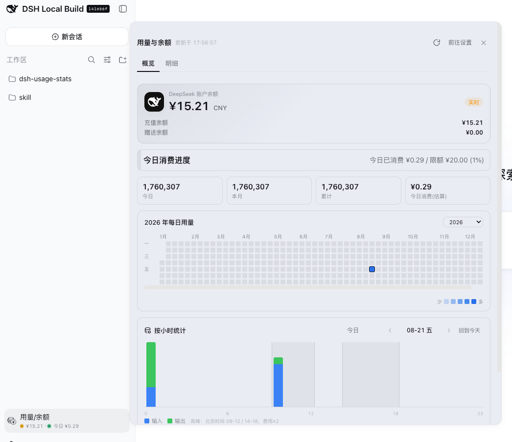
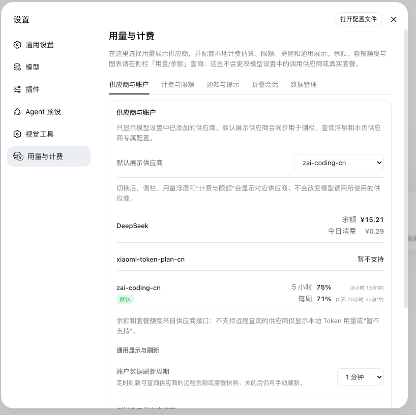
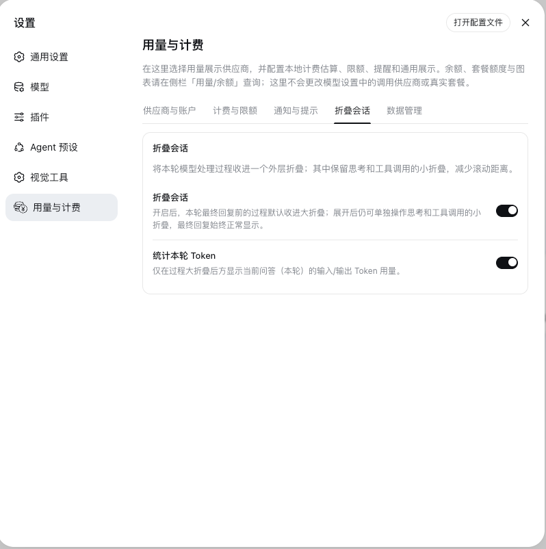
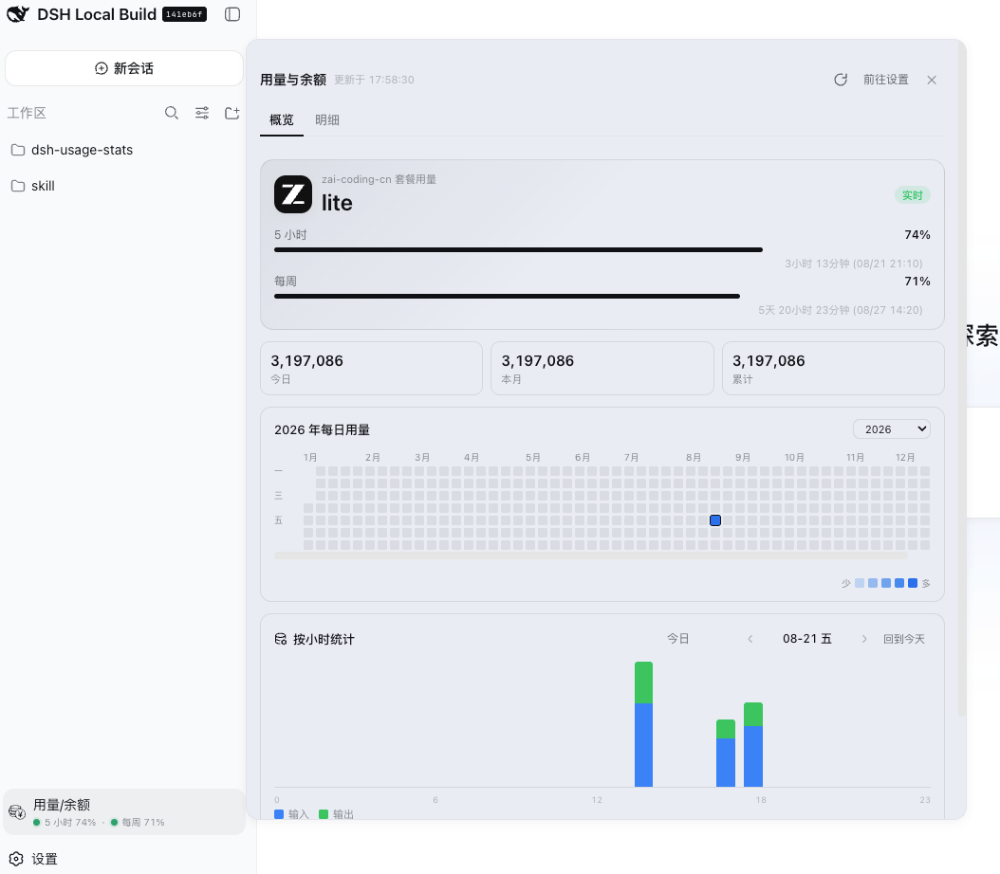
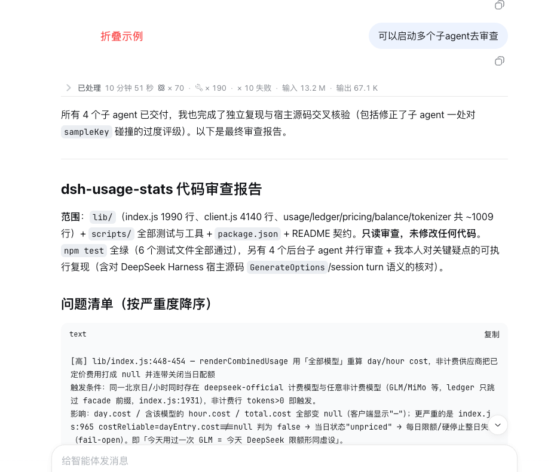

# dsh-usage-stats

为 [DeepSeek Harness](https://github.com/deepseek-ai/deepseek-harness) 网页端（`dsh web`）提供用量、余额与计费估算能力。侧栏「用量/余额」查询中心提供概览和明细；所有会改变计费、限额、通知或会话展示行为的配置都位于「设置 → 用量与计费」，查询浮层保持只读。默认展示供应商为 `deepseek-official`，也可跟随 Harness「模型」设置中当前已添加的 provider route。

DeepSeek official balance, token usage, a contribution heatmap, and per-hour statistics for the DeepSeek Harness Web GUI — opened from a dedicated sidebar action with model and API-key switchers.

## 功能 / Features

| | 能力 | 说明 |
| --- | --- | --- |
| 💳 | 供应商余额与套餐 | 按模型设置中已添加的 provider route 展示余额、套餐窗口或本地 Token；未支持远端查询的供应商显示「暂不支持查询」 |
| 🧭 | 独立侧栏入口 | 使用 Harness 原生 `sidebar.footer.action`；宽侧栏直接显示余额与今日消费，点击打开 760px 响应式查询中心 |
| 🗂️ | 查询中心双标签 | 「概览」：余额卡、四张摘要卡、年度热图、按小时统计；「明细」：模型筛选与按日明细，弹窗内不含任何配置表单 |
| ⚙️ | 独立设置入口 | 使用 Harness 原生 `settings.section` 注册「设置 → 用量与计费」，含供应商与账户 / 供应商用量与计费 / 通知与提示 / 折叠会话 / 数据管理五个标签；供应商价格、限额和套餐阈值跟随默认展示供应商 |
| 🧩 | 折叠会话过程 | 每个问答（turn）的思考、工具和过程说明收进一个外层大折叠；原有思考/工具小折叠保留，最终回复始终显示在外层大折叠之外。整体耗时与本轮 Token 只显示在大折叠上，小折叠不显示这些汇总信息 |
| 📊 | Token 用量统计 | 今日 / 本月 / 累计 Token，按 `provider/model` 归集，缓存命中率 |
| 🟩 | 贡献热图 | GitHub Contributions 风格按自然年展示每日 Token 强度，右上角可切换年份 |
| ⏱️ | 按小时统计 | 选中日期的 24 小时输入/输出柱状图；悬停显示 Token、费用和模型明细，高峰时段自动标注 |
| 💰 | 消费金额 | 仅估算 `deepseek-official` 的消费（CNY）；其他供应商保留 Token 明细但不计费。费用按**请求完成时间（usage 上报时间）**归属小时与峰谷 |
| ⚠️ | 用量提醒与限额 | DeepSeek 每日消费限额、余额提醒、预警比例和可选硬停止；套餐 provider 的 5 小时/每周阈值只控制状态点颜色 |
| 🛑 | 超限停止调用 | 默认仅提醒；显式开启 `stopOnExceed` 后，官方今日消费达到每日限额（100%）时，在 `llm/stream` 拦截新的官方模型调用；临界预警只提醒，不拦截 |
| 🔑 | 按 API Key 统计 | `keyProviders` 将 `deepseek-official` 路由映射到具体 Key，官方今日消费按 Key 归集、限额按 Key 判定 |
| 🔄 | 后台监测 | 服务端启动时会刷新一次；账户页可配置周期刷新，设置为“关闭”时停用服务端周期定时器。侧栏打开/关闭时分别按 1 分钟/5 分钟轮询摘要 |
| 🔒 | 本机安全边界 | 端点仅接受回环请求（`usage`/`keys`/`balance` 仅 GET，`limits`/`accounts`/`pricing`/`alerts`/`data` 支持 GET/POST）；API Key 只在服务端解析，绝不进入浏览器或日志 |

界面支持中文和英文。供应商列表以 Harness 的 `ctx.llm.listProviders()` 和 `ctx.llm.listConfigurableProviders()` 为基础，只保留当前模型设置中存在的可配置 route；`vision-toolkit-*` facade route 不展示。provider 名称沿用 Harness 模型设置中的预设名称，因此 `zai-coding-cn`、`xiaomi-token-plan-cn` 会按原名出现。没有内置远端适配器的 provider 仍可显示本地 Token，但不会发起猜测请求。Token 采集入口是 provider-reported `usage`（`assistant/chunk`、`assistant/message` 或 `llm/stream` usage chunk），服务端写入调用级 ledger；统计 API 不做本地 tokenizer 估算。对话折叠默认不显示 Token；开启本轮模式时按**单个问答（turn）**聚合当前聊天节点中的 assistant step，属于近似值；开启会话模式时直接读取 Harness `tokenUsage` projection，和底部统计一致但只表示整个会话累计。当前消费金额和 DeepSeek 官方限额只适用于 `deepseek-official`；统计、限额判定和「今日」口径均按北京时间。

### Provider 能力矩阵

| route 示例 | 远端查询 | 本地/计费行为 |
| --- | --- | --- |
| `deepseek-official` | `/user/balance` 余额 | CNY 估算、每日消费限额和余额提醒 |
| `openrouter` | `/api/v1/key`、`/api/v1/credits` | 余额展示，Token-only |
| `kimi-coding` | `/coding/v1/usages` | 5 小时/每周 Token 窗口，Token-only |
| `minimax`、`minimax-cn` | Token Plan remains API | 5 小时/每周比例窗口，Token-only |
| `zai`、`zai-coding-cn` | `/api/monitor/usage/quota/limit` | 5 小时/每周剩余比例和重置时间，Token-only |
| `xiaomi-token-plan-cn` | 暂无 API-key 适配器 | 显示本地 Token 或「暂不支持查询」，不读取 Cookie/CDP |

`declared` 只表示 Harness 目录来源，不是官方标志。插件只过滤 `vision-toolkit-*` facade，其他已添加 route 会按 Harness 原名出现在供应商列表中。

## 设置页行为

「设置 → 用量与计费」当前包含五个标签：

- **供应商与账户**：默认展示供应商、账户快照、刷新周期、侧栏余额/今日消费/状态点开关和手动刷新。默认 provider 会同步到侧栏、查询浮层和计费标签，但不会改变模型调用路由。
- **供应商用量与计费**：跟随默认展示供应商显示对应的供应商专属设置。DeepSeek 提供每日消费限额、预警比例、余额提醒、可选硬停止和价格编辑器；套餐 provider 提供 5 小时/每周剩余比例的状态点颜色。阈值只影响颜色，不改变远端额度；不支持的供应商只显示说明。
- **通知与提示**：只保留所有供应商共用的侧栏状态点和页面 Toast 通道、预警/超限/余额不足/恢复事件、冷却时间和当前进程内告警历史。插件页面 Toast 固定显示 5 秒，刷新页面不会重复播放旧告警。
- **折叠会话**：过程大折叠、本轮 Token 近似统计和会话累计 Token 统计开关。Token 统计默认关闭；本轮统计只根据当前聊天节点汇总，可能受分步调用、实时上报、分页或压缩影响而不等于实际用量。会话统计与 Harness 底部统计同口径且准确，但只能显示整个会话累计值，不能拆分到单条消息或单个问答；两种统计模式互斥。最终回复始终显示在折叠之外，小折叠仍可展开。
- **数据管理**：账本数量、容量、legacy 折叠数量和日期范围；按北京日历一次性裁剪或二次确认清空本地数据。裁剪不是持续后台策略。

每日消费进度横幅只在设置了每日消费限额时出现，只表达「今日消费 / 每日限额」；余额提醒不会改变它，也不会改变侧栏今日消费圆点。套餐阈值配置虽然由通知状态点消费，但属于供应商套餐设置，放在「供应商用量与计费」标签。

## 界面预览 / Screenshots

「用量/余额」查询中心（概览标签）：余额/套餐卡、Token 汇总、年度贡献热图与按小时统计。每日消费进度只有在设置每日消费限额后显示，使用中性灰黑色进度，不跟随告警颜色。



「设置 → 用量与计费 → 供应商与账户」：只显示模型设置中已添加的 provider，默认展示供应商同步影响侧栏、查询浮层和计费标签。



「设置 → 用量与计费 → 折叠会话」：控制过程大折叠、本轮 Token 近似统计和与 Harness 底部一致的会话累计 Token 统计。



「用量/余额」查询中心（Z.ai 套餐）：展示 5 小时、每周剩余比例和可用的重置倒计时。



折叠会话示例：最终回复保留在外层大折叠之外。



## 快速安装 / Quick start

需要 DeepSeek Harness `web` profile（`@deepseek-ai/dsh >= 0.1.0-rc.7`，`dsh plugin` 子命令自该版本引入）与 [pnpm](https://pnpm.io/installation)（`dsh plugin` 会把参数转发给 profile 目录里的 pnpm，因此所有 pnpm 子命令都可用）。

**本地 checkout 安装（开发推荐）**：在**包含插件目录的父目录**中执行（官方文档：从包含该包的目录运行），或已在插件根目录内用 `.`：

```bash
# 在 dsh-usage-stats 的父目录中执行
dsh plugin --profile web add ./dsh-usage-stats

# 或者已进入插件根目录
cd dsh-usage-stats
dsh plugin --profile web add .
```

目录路径安装会生成 `link:`（符号链接）依赖：改动插件代码**无需重新安装**，**重启正在运行的 `dsh web`** 并在浏览器硬刷新（Cmd/Ctrl+Shift+R）即可生效；侧栏底部会出现独立的「用量/余额」入口。

**从 npm 安装**（发布后即可使用）：

```bash
dsh plugin --profile web add @wannanbigpig/dsh-usage-stats
```

**从 GitHub 安装**（开发预览）：

```bash
dsh plugin --profile web add github:wannanbigpig/dsh-usage-stats
```

如需安装本地 tarball，可在 checkout 根目录执行：

```bash
package_tarball="$(npm pack --silent)"
dsh plugin --profile web add "./${package_tarball}"
```

**升级或卸载**（`update` 只对 npm/GitHub 安装的副本有意义；本地 `link:` 安装始终指向本地目录，直接 `git pull` 后重启 `dsh web` 即可）：

```bash
dsh plugin --profile web update @wannanbigpig/dsh-usage-stats
dsh plugin --profile web remove @wannanbigpig/dsh-usage-stats
```

## 凭据 / Credentials

插件通过 Harness 凭据服务读取 API Key，不会读取、创建或修改凭据文件，也绝不把 Key 发送到浏览器。把 Key 写入 `~/.dsh/.credentials.yaml`（或设置 `DSH_HOME` 后对应的目录）：

```yaml
# ~/.dsh/.credentials.yaml
DEEPSEEK_API_KEY: sk-your-key-here
```

默认读取 `DEEPSEEK_API_KEY`。多个账号 / 多个 API Key 时，在插件配置里追加凭据引用（名称即可，不要写 Key 值）：

```yaml
# ~/.dsh/profiles/web/cordis.patch.yml
- insert:
    - id: usage-stats
      name: "@wannanbigpig/dsh-usage-stats"
      config:
        keys:
          - DEEPSEEK_API_KEY
          - DEEPSEEK_API_KEY_2   # 第二个账号的凭据引用
```

当当前 provider 暴露多个 API Key 时，浮层余额卡片会显示「API Key」下拉框，可按 Key 查询余额。Token 统计来自调用级 ledger，日志不记录「用哪个 Key」，但记录 provider route；只有 `deepseek-official` 的消费可按 `keyProviders` 归集并参与限额。

其他 Harness provider 的 `apiKeyEnv` 由对应 provider profile 提供，例如 `OPENROUTER_API_KEY`、`KIMI_API_KEY`、`MINIMAX_API_KEY`、`ZAI_API_KEY`。插件只解析 credential ref，不会把密钥写入插件设置或发送到浏览器。

## 配置 / Configuration

所有配置都是可选的，默认值即可开箱使用：

| 字段 | 类型 | 默认值 | 说明 |
| --- | --- | --- | --- |
| `keys` | `string[]` | `["DEEPSEEK_API_KEY"]` | 余额查询使用的凭据引用列表 |
| `defaultKeyRef` | `string` | `DEEPSEEK_API_KEY` | 默认选中的 Key |
| `baseURL` | `string` | `https://api.deepseek.com` | DeepSeek API 地址（`/user/balance` 相对此地址） |
| `refreshMs` | `number` | `300000` | 启动配置中的余额缓存/刷新基线（毫秒，最小 5000）；设置页可选“关闭”停用服务端周期刷新 |
| `pricing.pricing` | `object` | 见下 | `deepseek-official` 模型单价（CNY / 1M tokens）覆盖 |
| `pricing.peakMultiplier` | `number` | `2` | 官方高峰时段价格为空闲时段的 2 倍 |
| `pricing.peakHours` | `[start,end)[]` | `[[9,12],[14,18]]` | 官方高峰时段，北京时间 09:00–12:00、14:00–18:00 |
| `pricing.currency` | `string` | `CNY` | 消费金额显示货币；与 DeepSeek 中国区余额默认币种保持一致 |
| `keyProviders` | `object` | `{}` | Key → provider 路由列表；开启后今日消费按 Key 归集、限额按 Key 判定 |
| `maxLedgerEntries` | `number` | `5000` | 调用级 ledger 容量，超出后旧记录折叠进 legacy 快照 |
| `allowInsecure` | `boolean` | `false` | 允许非 HTTPS `baseURL`（不推荐） |

页面中的“默认展示供应商”属于运行时设置，保存在 `~/.dsh/storages/usage-settings.json`，默认值为 `deepseek-official`。查询面板不提供第二个 provider 选择器，侧栏、查询面板和计费标签都跟随这里的选择；它不会修改模型调用路由。

当前内置远端适配器为：DeepSeek `GET /user/balance`、OpenRouter `/api/v1/key` 与 `/api/v1/credits`、Kimi `/coding/v1/usages`、MiniMax `/v1/token_plan/remains`（回退旧路径）、Z.ai `/api/monitor/usage/quota/limit`。小米 `xiaomi-token-plan-cn` 当前没有 API-key 配额接口，不读取 MIMO-CLI Cookie、浏览器或外部 CLI 配置；接口失败时保留明确状态，不会把错误当作零额度。

### 按 API Key 统计（keyProviders）

会话日志不记录「用哪个 API Key」，但每个请求都记录 provider 路由。当前只有 `deepseek-official` 路由参与 DeepSeek 消费归集和限额；外部 provider 的映射不会让其 Token 变为 DeepSeek 消费：

```yaml
# ~/.dsh/profiles/web/cordis.patch.yml
- insert:
    - id: usage-stats
      name: "@wannanbigpig/dsh-usage-stats"
      config:
        keys:
          - DEEPSEEK_API_KEY
          - DEEPSEEK_API_KEY_2
        keyProviders:
          DEEPSEEK_API_KEY: [deepseek-official]
```

未映射的 `deepseek-official` 消费归到 `defaultKeyRef`。**未配置 `keyProviders` 时**，所有 Key 共享官方全局今日消费（此时每个 Key 的每日限额按该金额判定）。余额始终按所选 Key 单独查询。

### 供应商用量与计费（设置 → 用量与计费 → 供应商用量与计费）

该标签自动跟随「供应商与账户」中的默认展示供应商，不提供第二个供应商选择器。DeepSeek 可**按 Key（或全局）**配置；**仅配置一个 API Key 时，「目标 API Key」选择器自动隐藏**：

- **启用限额**：开关。
- **每日消费限额**（CNY）：今日估算消费达到限额 × `alertPercent`（默认 80%）→ 黄色预警；达到限额 × `criticalPercent`（默认 90%）→ 红色已超限（仅提醒与告警，不拦截）；两个比例都可在设置页调整。
- **余额提醒线**：新鲜余额低于该值 → 余额预警；只影响余额状态和通知，不改变今日消费进度或侧栏今日消费圆点。余额过期或查询失败时显示灰色状态且 fail-open。
- **预警百分比**：可调整数范围；`alertPercent` 为 1–99%，`criticalPercent` 为 2–100%，且临界值必须高于预警值。
- **超限停止调用**：默认关闭，仅提醒；用户显式开启后，官方今日消费达到每日限额（100%）时，在 `llm/stream` 拦截新的官方模型调用（抛出 `UsageLimitExceededError`）。临界预警只显示状态并触发告警，不拦截；余额查询失败或快照过期时 fail-open。当前 UI 开启硬停止前会要求确认，其他限额变更会立即保存。

限额保存在 `~/.dsh/storages/usage-limits.json`，当前 schema 为 v2。旧 v1 文件会安全迁移：保留提醒规则，但不会自动继承旧 `stopOnExceed` / `minBalance` 为硬停止；用户需在设置页重新确认开启。v2 会拒绝未知配置字段。**规则解析采用全局兜底**：某个 Key 未设置数值（或仅有空壳规则）时，沿用全局限额；Key 设置了数值则覆盖全局、未设置的字段继续继承全局，因此全局限额始终是底线，不会被空壳 Key 规则静默绕过。拦截采用 **fail-open** 策略：限额检查本身出错时放行调用，绝不因插件故障阻塞模型。

状态统一为 `normal / warning / exceeded / blocked / stale / unavailable / unpriced`。`unpriced` 表示当日含未定价的 DeepSeek 模型，消费金额不可靠，日限额不参与拦截且 fail-open。侧栏状态点与设置页读取同一个 `/limits` 状态源；告警只在状态跨越或冷却到期时触发，恢复正常时生成一次恢复事件。

默认单价（CNY / 1M tokens，严格对应 DeepSeek 官方中文价格页，2026-08）：

| 模型 | 命中·空闲 | 命中·高峰 | 未命中·空闲 | 未命中·高峰 | 输出·空闲 | 输出·高峰 |
| --- | --- | --- | --- | --- | --- | --- |
| `deepseek-v4-flash` | 0.05 | 0.10 | 1.5 | 3 | 4.5 | 9 |
| `deepseek-v4-pro` | 0.15 | 0.30 | 4.5 | 9 | 13.5 | 27 |
| 未配置模型 | — | — | — | — | — | — |

高峰时段为北京时间 09:00–12:00、14:00–18:00，其余为空闲时段；高峰单价为空闲单价的 2 倍。未识别的官方模型与所有外部供应商均显示 Token；费用显示 `—`，不会静默套用其他模型价格。官方价格可能调整，请定期对照 <https://api-docs.deepseek.com/zh-cn/quick_start/pricing/>；可在 `pricing.pricing` 中按模型 id 覆盖。

价格覆盖可以只填写需要调整的字段，未填写的输入命中/未命中/输出单价会继承当前模型值；在「供应商用量与计费」中点击「自定义价格」会带入当前方案，保存后新账本使用新价格。空值、非数字和负数会被前后端拒绝；`peakHours` 必须满足 `0 <= start < end <= 24`。

## 使用 / Usage

1. 侧栏底部 **用量/余额** 会直接显示默认账户余额与今日消费：查询面板打开时每分钟刷新，关闭时每 5 分钟刷新；点击整行打开查询中心，窄侧栏模式只显示数据图标。
2. 查询中心分「概览 / 明细」两个标签：概览 = 余额卡、四张摘要卡、年度每日用量热图、按小时统计与所选日期模型摘要；明细 = 模型筛选与最近日期按日明细（点击日期可联动概览小时图）。
3. 顶部余额卡片：DeepSeek 官方余额 + 充值/赠送明细；多个 Key 时可切换；右上角刷新时图标会持续旋转到请求结束，旁边有「前往设置」链接。余额查询失败会缓存错误快照并在 `refreshMs`（默认 5 分钟）内复用，网络错误时余额显示「暂不可用」。
4. 「年度每日用量」：默认只展示今年 1–12 月；右上角切换年份，悬停方块查看整日日期、Token、输入/输出、缓存、费用和模型摘要，点击方块联动当天明细。
5. 「按小时统计」：展示所选日期的 24 小时输入/输出柱状图；零用量小时不渲染数据柱，高峰时段以跨全图的浅色背景区段提示；鼠标悬停、键盘聚焦或触屏点击某小时可查看总 Token、输入、输出、缓存、费用和模型拆分。费用与 Token 按**请求完成时间（usage 上报时间）**（北京时）归入对应小时：跨整点边界的流式请求同样按完成时间归属（如 17:59 发起、18:01 完成的请求计入 18 点小时并按空闲价计费，而不是计入 17 点高峰价），与官方账单口径一致。
6. 限额、价格、通知和展示配置请在「设置 → 用量与计费」中操作；「供应商用量与计费」自动跟随默认展示供应商。DeepSeek 可按 Key（或全局）配置每日消费限额、余额提醒线、预警百分比与是否停止新调用；套餐供应商只显示其支持的窗口阈值；开启硬停止时会弹出确认。
7. 「折叠会话」设置只控制过程折叠与大折叠 Token 显示；每个大折叠对应一个问答 turn，最终回复不被折叠。本轮 Token 是当前聊天节点的近似汇总，可能因 Harness 的多步调用、usage 实时发布、分页或压缩而不等于实际用量；会话 Token 模式直接复用 Harness 的 `tokenUsage` projection，与底部统计一致，但只表示整个会话累计，不能记录单条消息用量。

## 官方 tokenizer 离线计算

实际请求统计始终使用模型响应中的 provider-reported `usage`。这是账单与缓存命中最接近的口径；离线 tokenizer 只能计算传入的可见文本，无法还原服务端 system prompt、工具定义、缓存读写或隐藏推理 Token，因此不会混入余额与费用统计。

若已从 DeepSeek 官方文档下载 `deepseek_v3_tokenizer`，可用其 `tokenizer.json` 与 `tokenizer_config.json` 做离线文本计算（离线计数默认**不含 BOS/EOS 等特殊 token**）：

```bash
npm run tokens -- \
  --tokenizer-dir /Users/liuml/Downloads/deepseek_v3_tokenizer \
  --json 'token 用量计算'
```

也可通过环境变量 `DEEPSEEK_TOKENIZER_DIR` 指定目录，或从 stdin 输入文本。该实现使用 Hugging Face 的 `@huggingface/tokenizers` 直接读取官方文件，不需要 Python `transformers`。

> 注意：`npm run tokens` 属于开发/诊断工具，`scripts/` 不随 npm 包发布，该命令仅在**源码仓库 checkout** 下可用；通过 npm 安装的插件包不含此 CLI。

## 数据与隐私 / Privacy

- API Key 只在服务端凭据服务中解析，响应中只有余额数值，没有任何 Key。
- 端点仅接受回环地址请求（peer socket 校验 + Host 二次校验）；`usage` / `keys` / `providers` / `balance` 仅 GET，`limits` / `accounts` / `pricing` / `alerts` / `data` 支持 GET/POST（本机设置写入）。非允许方法返回 405，非回环返回 403。
- 用量缓存 `~/.dsh/storages/usage-stats-cache.json` 保存两部分：**调用级账本**（每次模型请求的稳定 ID、发起时间 `occurredAt`、完成时间 `completedAt`、provider/model、usage、当次 `costCny` 和 `pricingVersion`；统计归属按完成时间，流结束后立即原子落盘）和 **legacy 快照**（历史聚合，无请求时间明细，费用按当前价格估算）；账本默认上限 5000 条，超出后最旧记录折叠进 legacy，不会无限增长。不保存提示词、回复或文件路径。Token 的采集入口是 `llm/stream` usage chunk 与 `assistant/message` 事件，`/usage` 读取持久化 ledger/legacy 快照。限额配置保存于 `~/.dsh/storages/usage-limits.json`。
- 本机反向代理会让插件看到代理自身的回环地址；请勿把端点经反向代理暴露到局域网或公网。

## API

| Method | Path | Response |
| --- | --- | --- |
| `GET` | `/api/usage-stats/usage` | 按日期/小时/模型聚合的 Token、缓存命中率与估算费用（含 `pricing` 配置）；费用按请求完成时间（usage 上报时间）归属小时与峰谷 |
| `GET` | `/api/usage-stats/keys` | 已配置的 API Key 凭据引用列表（仅名称，不含值） |
| `GET` | `/api/usage-stats/providers` | Harness provider 目录、能力、credential 状态和当前默认展示供应商 |
| `GET` | `/api/usage-stats/balance?provider=<id>&key=<ref>&refresh=1` | 所选供应商账户的余额或 Token Plan 快照；省略 `provider` 兼容 DeepSeek 官方余额 |
| `GET` | `/api/usage-stats/limits` | v2 限额配置 + 每个 Key 的统一实时状态及告警跨越/冷却/恢复元数据 |
| `POST` | `/api/usage-stats/limits` | 保存限额配置（本机回环），返回最新状态 |
| `GET` | `/api/usage-stats/accounts` | 各 Key/供应商的余额快照状态 + 默认供应商、刷新周期与侧栏展示开关 |
| `POST` | `/api/usage-stats/accounts` | 保存 `defaultProviderId`、刷新周期、侧栏展示开关和会话折叠设置（本机回环） |
| `GET` | `/api/usage-stats/pricing` | 当前价格方案 + 官方只读基线（含核对时间、来源 URL） |
| `POST` | `/api/usage-stats/pricing` | 保存自定义方案（`mode=custom`）或恢复官方（`action=restore`） |
| `GET` | `/api/usage-stats/alerts` | 告警历史 + 通知策略（通道/事件/冷却） |
| `POST` | `/api/usage-stats/alerts` | 保存通知策略（本机回环） |
| `GET` | `/api/usage-stats/data` | 本地聚合元信息（账本条目、上限、日期范围、折叠计数） |
| `POST` | `/api/usage-stats/data` | 重新读取聚合、执行 `trim`（保留天数）或 `clear`（必须携带 `confirmation: "清除"` 或 `"DELETE"`；服务端也会校验） |

## 开发与验证 / Development

```bash
npm install
npm test
npm pack --dry-run
```

`npm test` 完全离线，覆盖：
- `scripts/test-usage.mjs`：折叠语义（替换不重复计数、跨日移动）、小时桶、费用计算、真实会话日志折叠（设置 `DSH_SESSION_LOG` 指向 `session.jsonl` 可复现）；
- `scripts/test-tokenizer.mjs`：`tokenizer.json` / `tokenizer_config.json` 加载、编码计数与缺失文件错误；
- `scripts/test-server.mjs`：配置校验、路由注册、余额缓存与单飞、凭据不泄露、v1→v2 限额迁移、统一状态机、阻断/fail-open、告警冷却与恢复；
- `scripts/test-providers.mjs`：DeepSeek/OpenRouter/Kimi/MiniMax/Z.ai 适配器的离线 mock、鉴权错误、超时和 MiniMax 回退顺序；
- `scripts/smoke-client.mjs`：客户端 bundle、侧栏入口、自然年贡献热图、小时悬停浮层、刷新动画、统一状态映射与硬停止设置契约。
- `scripts/test-conversation.mjs`：每个 turn 的大折叠/小折叠、最终回复保留、耗时、单 turn Token 聚合、终止与局部工具失败状态。

真实数据验证需先运行 `dsh web`，然后打开「用量/余额」浮层或：

```bash
curl -s http://127.0.0.1:3080/api/usage-stats/usage | head -c 400
curl -s http://127.0.0.1:3080/api/usage-stats/balance
```

## License

[MIT](LICENSE)
